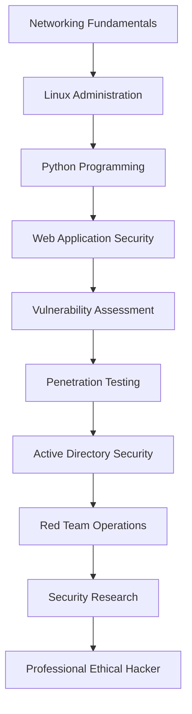

# 

<div align="center">

# 🛡️ Waseem Ahamed

### Frontend Developer • Cybersecurity Student • Future Ethical Hacker


<p align="center">


</p>

</div>

---

# 🚀 About Me

```yaml
Name: Waseem Ahamed
Location: Anuradhapura, Sri Lanka 🇱🇰
Role: Frontend Developer & Cybersecurity Student

Current Focus:
  - Ethical Hacking
  - Penetration Testing
  - Web Application Security
  - Linux Administration
  - Networking
  - Security Research

Career Goal:
  Become a Professional Ethical Hacker
  and Penetration Tester
```

### 🎯 Mission

I am a cybersecurity enthusiast focused on building strong foundations in offensive security, vulnerability assessment, and security research. I enjoy learning how systems work, identifying weaknesses, and developing practical security skills that contribute to safer digital environments.

---

# 🛠️ Cybersecurity Skills

### 🔴 Offensive Security


### 🔵 Security Domains


---

# 💻 Tech Stack

### Languages

<p align="left">


</p>

### Operating Systems

<p align="left">


</p>

### Tools & Platforms

<p align="left">


</p>

### Cybersecurity Tools


---

# 📚 Learning Journey

```text
Frontend Development      ████████████████████ 90%

Linux Fundamentals        █████████████████░░ 85%

Networking                ████████████████░░░ 80%

Python                    ███████████████░░░░ 75%

Web Security              ██████████████░░░░░ 70%

Penetration Testing       █████████████░░░░░░ 65%

Red Teaming               ███████████░░░░░░░░ 55%

Security Research         ██████████░░░░░░░░░ 50%
```

---

# 🗺️ Cybersecurity Roadmap



---

# 📊 GitHub Statistics

<div align="center">


</div>

---

# 🔥 GitHub Streak

<div align="center">


</div>

---

# 🏆 Achievements

* 🛡️ Building a strong foundation in Ethical Hacking
* 🔍 Learning Vulnerability Assessment & Security Research
* 🌐 Frontend Developer transitioning into Cybersecurity
* 🐧 Linux Enthusiast
* ⚡ Passionate about Red Teaming
* 📚 Continuous Learner
* 🎯 Future Penetration Tester

---

# 🎓 Certifications

### Professional Certifications

🏅 Certified Ethical Hacker (CEH)

🏅 Cybersecurity & Ethical Hacking

🏅 Career Essentials in Cybersecurity
(Microsoft & LinkedIn)

🏅 Threat & Vulnerability Management

🏅 Basics of Python

---

# 🚀 Current Objectives

```diff
+ Master Networking Fundamentals
+ Advance Linux Administration Skills
+ Learn Active Directory Security
+ Complete More CTF Challenges
+ Build Security Projects
+ Develop Penetration Testing Skills
+ Contribute to Open Source Security Tools
+ Become a Professional Ethical Hacker
```

---

# 🤝 Connect With Me

<p align="center">

<a href="https://linkedin.com/in/YOUR_LINKEDIN">

</a>

<a href="mailto:your-email@example.com">

</a>

<a href="https://github.com/YOUR_USERNAME">

</a>

</p>

---

<div align="center">

### ⚔️ "Hack to Learn, Learn to Secure."


</div>
